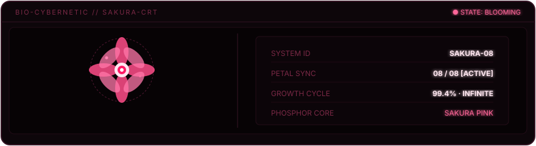
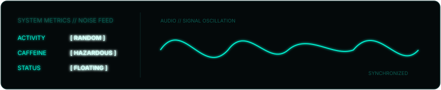
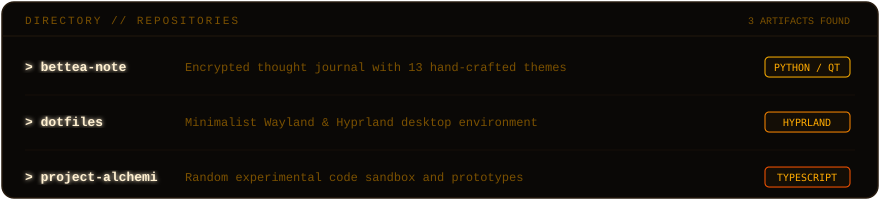
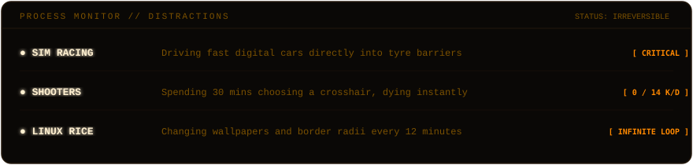

<!-- 1. AMBER HEADER -->

  

<!-- COLOR-CODED SHIELDS BADGES -->

  
  
  
  

 

<!-- 2. SAKURA PINK FLOWER TILE -->

  

<!-- 3. ELECTRIC CYAN SIGNAL TILE -->

  

<!-- 4. ELECTRIC VIOLET REPOSITORIES TILE -->

  

<!-- 5. VOLCANIC CRIMSON DISTRACTIONS TILE -->

  

<!-- 6. AMBER MINIMAL TYPEWRITER (MOVED TO BOTTOM) -->

  

<!-- 7. FOOTER -->

